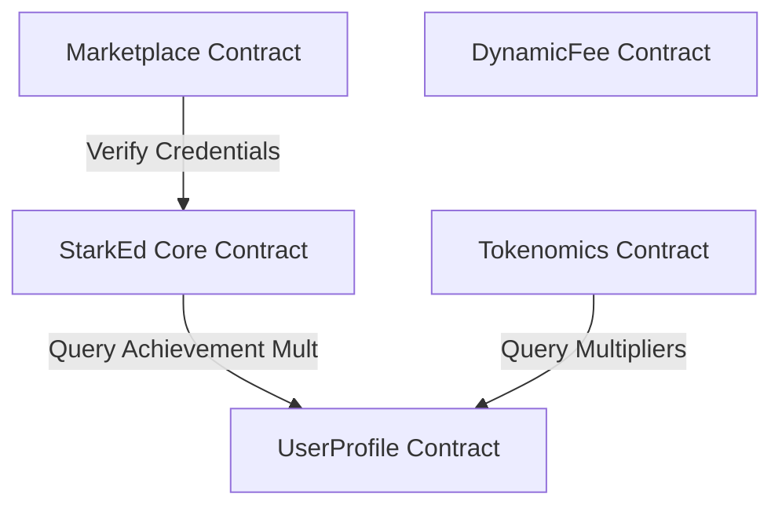

# StarkEd On-Chain Contracts Reference Guide

This reference guide provides an overview of the StarkEd smart contracts system deployed on Stellar / Soroban. It documents the public interfaces, core data structures, entry points, and integration patterns for smart contract developers and system integrators.

---

## 1. System Architecture Overview

StarkEd is structured as a modular suite of smart contracts centered around a main entry point contract. This architecture ensures separation of concerns, gas optimization, and modular upgrades:



---

## 2. Core Smart Contracts & Entry Points

### 2.1 Core StarkEd Contract (`StarkEdContract`)
The root contract of the StarkEd system. It aggregates on-chain credentials issuance, course records, cross-chain verification relays, and dynamic NFT badges.

#### Key Types
- **`Credential`**:
  ```rust
  pub struct Credential {
      pub id: u64,
      pub issuer: Address,
      pub recipient: Address,
      pub title: String,
      pub course_id: String,
      pub ipfs_hash: String,
      pub timestamp: u64,
      pub status: CredentialStatus,
      pub expires_at: Option<u64>,
  }
  ```
- **`CrossChainProof`**:
  ```rust
  pub struct CrossChainProof {
      pub credential_id: u64,
      pub issuer: Address,
      pub issued_at: u64,
      pub status: CredentialStatus,
      pub proof_timestamp: u64,
      pub expires_at: u64,
      pub proof_hash: BytesN<32>,
  }
  ```

#### Public Methods
- **`initialize(env: Env, admin: Address)`**: Initialises the contract, sets the admin address, and assigns RBAC Admin role.
- **`issue_credential(...) -> u64`**: Issues a new on-chain credential to a learner. Only callable by Admin.
- **`verify_credential(env: Env, credential_id: u64) -> bool`**: Returns `true` if the credential ID exists on-chain.
- **`generate_credential_proof(env: Env, credential_id: u64, relayer: Address) -> CrossChainProof`**: Generates a cryptographically hashed proof of a credential for external chain verification.
- **`verify_cross_chain_proof(env: Env, proof: CrossChainProof) -> bool`**: Cryptographically validates a relayed cross-chain verification proof.
- **`mint_dynamic_nft(...) -> u64`**: Mints a dynamic achievement badge (NFT) for a learner. Only callable by Admin.
- **`evolve_nft(env: Env, token_id: u64, achievement_id: u64, new_metadata: String) -> bool`**: Unlocks an achievement on a badge, earning XP and potentially upgrading the visual traits.

---

### 2.2 User Profile Contract (`UserProfileContract`)
Manages learner profiles, achievements weight tracking, and profile privacy levels.

#### Key Types
- **`UserProfile`**:
  ```rust
  pub struct UserProfile {
      pub owner: Address,
      pub username: String,
      pub email_hash: String,
      pub bio_hash: String,
      pub avatar_hash: String,
      pub timestamps: PackedTimestamps,
      pub achievement_count: u32,
      pub credential_count: u32,
      pub reputation: u64,
      pub flags: PackedUserFlags,
  }
  ```
- **`Achievement`**:
  ```rust
  pub struct Achievement {
      pub id: u64,
      pub user: Address,
      pub title: String,
      pub description: String,
      pub timestamp: u64,
      pub badge_hash: String,
      pub tier: u32,
      pub weight: u32,
  }
  ```

#### Public Methods
- **`create_or_update_profile(env: Env, owner: Address, username: String, email: Option<String>, bio: Option<String>, avatar_url: Option<String>, privacy_level: PrivacyLevel) -> UserProfile`**: Registers or updates a learner profile.
- **`add_achievement(...) -> u64`**: Assigns a course/activity achievement to a profile.
- **`get_achievement_mult_bps(env: Env, user: Address) -> u32`**: Returns the reputation-based staking multiplier in basis points (bps).

---

### 2.3 Tokenomics Contract (`TokenomicsContract`)
Controls the distribution of reward tokens, locking utility tokens in staking pools, and quadratically voting on scholarship proposal allocations.

#### Public Methods
- **`stake_tokens(env: Env, staker: Address, amount: u64, lock_duration: u64)`**: Locks utility tokens into the staking pool. Staking APY is boosted by learner achievement weights.
- **`unstake_and_claim(env: Env, staker: Address)`**: Unlocks staked tokens and claims earned yield.
- **`create_proposal(env: Env, creator: Address, title: String, description: String, voting_period: u64) -> u64`**: Creates a governance voting proposal.
- **`disburse_scholarship(env: Env, proposal_id: u64, student: Address)`**: Pays out scholarship funds to eligible students (validated against on-chain credentials).

---

### 2.4 Marketplace Contract (`MarketplaceContract`)
Enables secondary credential sales, rental leases, and escrow/dispute resolution for course resources.

#### Public Methods
- **`list_credential(env: Env, seller: Address, credential_id: u64, price: u64, royalty_bps: u32) -> u64`**: Lists a credential for sale.
- **`create_escrow(env: Env, buyer: Address, listing_id: u64, timeout: u64) -> u64`**: Creates a funded escrow locking tokens for delivery.
- **`confirm_delivery(env: Env, buyer: Address, escrow_id: u64)`**: Releases locked escrow funds to the seller.
- **`escalate_escrow_to_dispute(env: Env, caller: Address, escrow_id: u64, reason: String) -> u64`**: Escalates a trade issue to the on-chain dispute board.

---

### 2.5 Dynamic Fee Contract (`DynamicFeeContract`)
Computes dynamic variable fee rates based on transaction values and congestion demand tiers.

#### Public Methods
- **`calculate_fee(env: Env, transaction_value: u64, transactions_per_block: u64) -> FeeCalculation`**: Calculates total transaction fee (base + variable + congestion surge).

---

## 3. Integration Code Examples

### 3.1 Initializing Core Contract and Issuing a Credential
Integrators can use the following pattern in Rust tests or external contracts to interact with the main StarkEd contract:

```rust
use soroban_sdk::{Env, Address, String};
use starked_education_contracts::{StarkEdContract, StarkEdContractClient};

fn issue_new_credential(env: &Env, admin: Address, learner: Address) -> u64 {
    // 1. Instantiate the contract client
    let contract_id = env.register_contract(None, StarkEdContract);
    let client = StarkEdContractClient::new(env, &contract_id);
    
    // 2. Initialise the contract (callable once)
    client.initialize(&admin);
    
    // 3. Define credential metadata details
    let title = String::from_str(env, "Certified Soroban Architect");
    let course_id = String::from_str(env, "soroban-101");
    let ipfs_hash = String::from_str(env, "QmXoypizjW3WknFixt2xHCZnA2tcoStzVkpVSz5j3t9834");
    
    // 4. Issue the credential (requires admin signing)
    env.mock_all_auths(); // Mock authorization signature in tests
    let credential_id = client.issue_credential(
        &admin,
        &learner,
        &title,
        &course_id,
        &ipfs_hash,
    );
    
    credential_id
}
```

### 3.2 Generating and Verifying a Cross-Chain Proof
Off-chain relayers can fetch and verify credential validity using the cross-chain proof:

```rust
use soroban_sdk::{Env, Address};
use starked_education_contracts::{StarkEdContract, StarkEdContractClient};

fn generate_and_verify_relay_proof(env: &Env, credential_id: u64, relayer: Address) {
    let contract_id = env.register_contract(None, StarkEdContract);
    let client = StarkEdContractClient::new(env, &contract_id);
    
    // Generate the compact cross-chain proof
    let proof = client.generate_credential_proof(&credential_id, &relayer);
    
    // Validate the proof matches active on-chain records
    let is_valid = client.verify_cross_chain_proof(&proof);
    assert!(is_valid);
}
```

---

## 4. Troubleshooting & Best Practices

1. **RBAC Validation Error**: Ensure that the caller executing administrative entry points possesses the required role (e.g. `Role::Admin` or `Role::Issuer`). Use `has_role` to check role membership before invoking.
2. **Circuit Breaker Status**: State-changing operations will panic with `"Contract is paused. Emergency mode active."` if the pause circuit breaker is engaged.
3. **Overflow Protection**: All arithmetic operations inside the dynamic fee and tokenomics calculators use bit-widening (`u128`) and checked math to prevent potential overflow errors.
